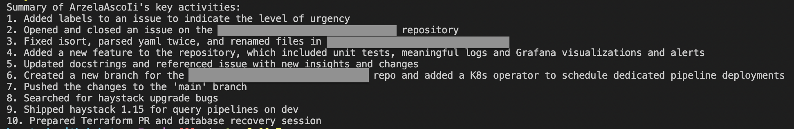

# Github EOD BOT 
A LLM powered github end-of-day bot.

Powered by [haystack](https://haystack.deepset.ai/) and [OpenAI](https://openai.com/)


This github bot crawls your github activity of a selected day, groups the events by action (Push, Pull Request, Issue, etc.) and sends you a summary of your activity in natural language. This message can be used as EOD(End of Day) report in your slack channel. 

> This bot should help me to close my laptop and be happy about the work I've done on that day. Hopefully it will help you too.

A summary can look like this:


> :warning: **Please be careful with sensitive data**: You might be working on a project that contains sensitive data that should not leave your company. Please make sure what you are sending to OpenAI before running this bot!


This example of a haystack promptnode uses two templates to generate a summary of actions. The [first template](/prompts/events.txt) is used to generate a summary per event type from github. The [second template](/prompts/summary.txt) is used to generate the final summary of all events.


## Limitations
The challenging part was to make GPT 'hallucinate' just the right amount to connect the dots but not make up facts. The bot is not perfect and will make mistakes. The most common issue I saw in my tests was that the bot lists irrelevant events/actions like `Pushed something to main.` There is still some room for improvement for the prompt templates.
## How to use it
### Installation 
1. Clone this repository
2. Install the dependencies with `pip3 install -r requirements.txt`. This installs haystack and some other required packages to fetch the data from github.
3. Create a new github access token.
4. Create a OpenAI API key.

### Run 
Run the bot with 
```sh 
GH_ACCESS_TOKEN=<your-token> OPENAI_KEY=<openai-key> python3 main.py
```


